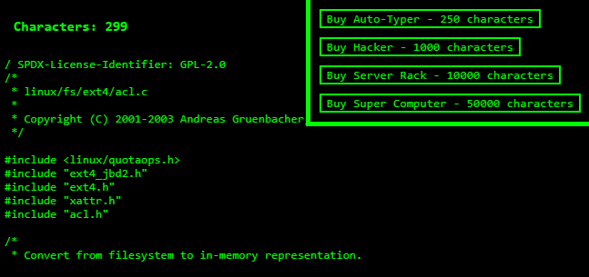

# Idle Typer

## Description
You've heard of Cookie Clicker, now get ready for... Code Typer! Yay. We all love code.
In Idle Typer, you type to gain 'characters', which can be used to purchase upgrades. These upgrades yield you
a certain amount of characters per second. The more expensive the upgrade, the more cpp you gain.

## Why
As one of Mintbean's hackathons, I only had 4 hours to make a project with the theme 'Idle Clicker'. I decided
to spin the theme a little and make an Idle Typer. I also took the opportunity to use React.js and jQuery for 
the first time. I thoroughly enjoyed using and can see myself using them in the near future.

## License
